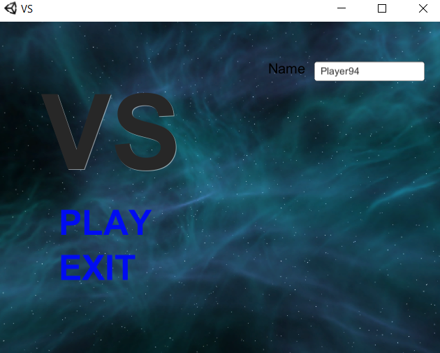
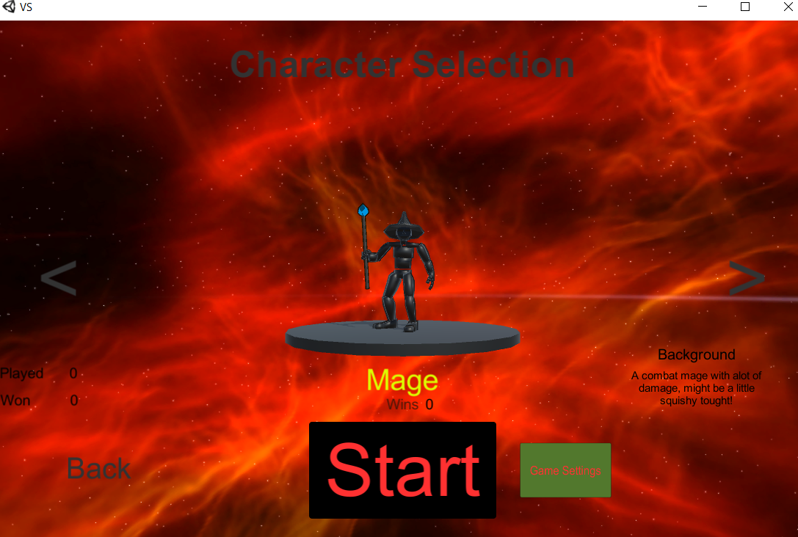
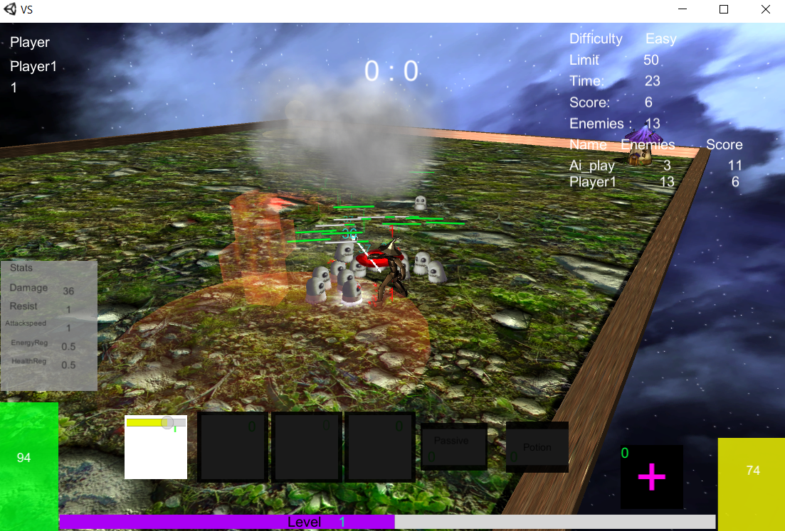

# VS-1DV437
Game developed in Unity3d for course 1DV437 at LinneUniversitetet.
The Game VS is a single player MOBA i created during summer 2017.
The Game need quite alot more work but is a nice start of a complete game.
With the end goal to create a lan game i can play with friends.
All characters and animations are free assets taken from store.

# How-To
A runnable exist in the folder : "VS/VS/Build/VS.exe".
This game is inspired from the WC3 mod Rabbits Vs Sheeps. Where the goal is to kill mobs faster then your opponent. If any player have 150 or more minions left for 10 seconds that player lose. To get started you need to add a playername if you dont want to use the generated one. Then chose your hero, more will be developed in the future. Then start the game.

See screenshots below:

